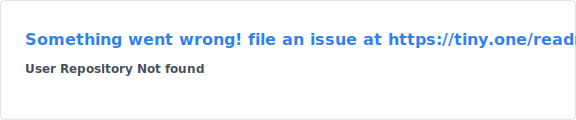

# ⚡ 

  
  

---

### 📂 [SYSTEM_LOG]
> `> Loading developer_profile.sh...`
> 
> **现状**:  AI编程受益者；学习中……
> **技能**: `Python` | `Linux` | `vibe coding`

---

<h3 align="center">📊 [STATISTICS & TECHNOLOGIES]</h3>

  
  &nbsp;
  
    

---
