## 🌸 🌸

  
  

---

> **现状**:  AI编程受益者；学习中……  
> **技能**: `Python` | `Linux` | `Vibe coding`

---

  <picture>
    <source media="(prefers-color-scheme: dark)" srcset="./profile/stats-dark.svg">
    <source media="(prefers-color-scheme: light)" srcset="./profile/stats-light.svg">
    
  </picture>

  <picture>
    <source media="(prefers-color-scheme: dark)" srcset="./profile/top-langs-dark.svg">
    <source media="(prefers-color-scheme: light)" srcset="./profile/top-langs-light.svg">
    
  </picture>

---
